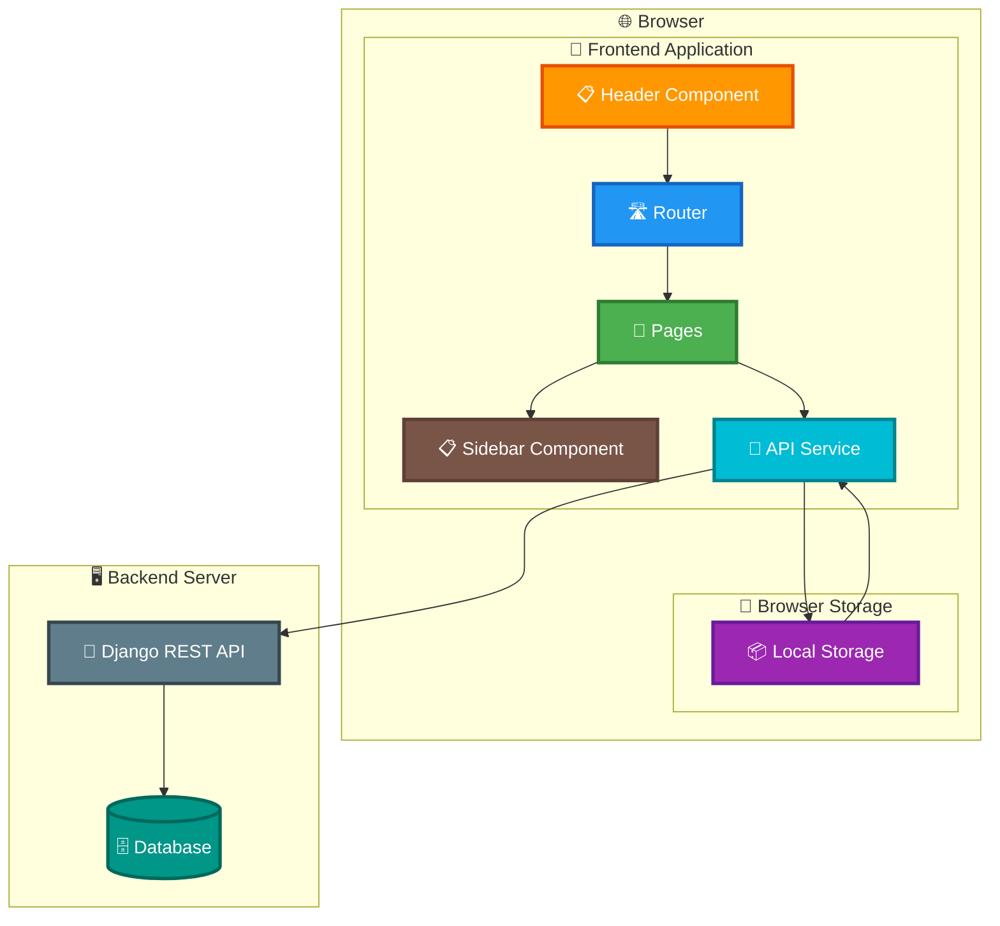
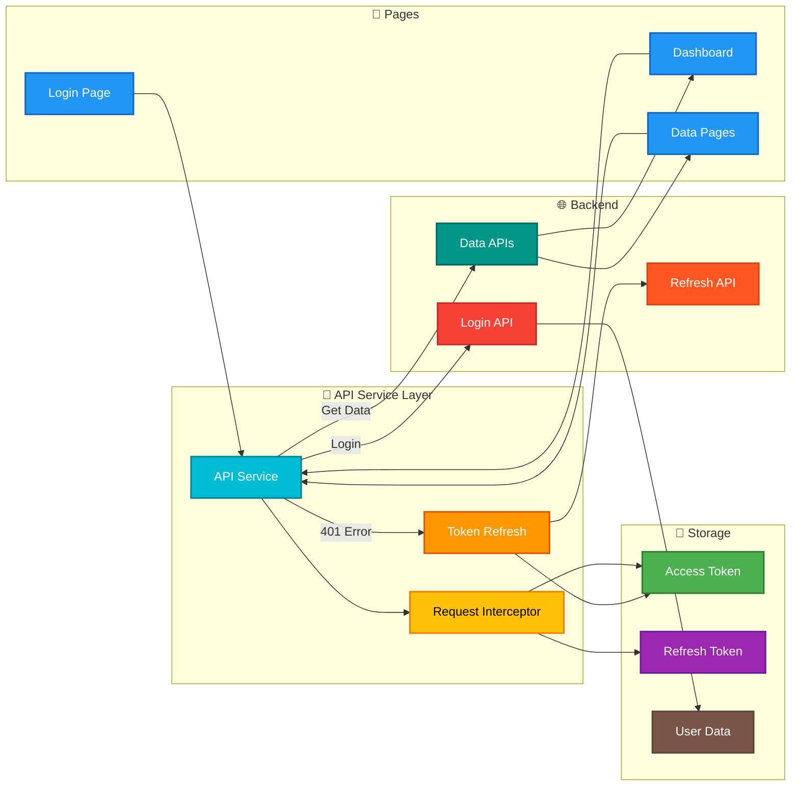
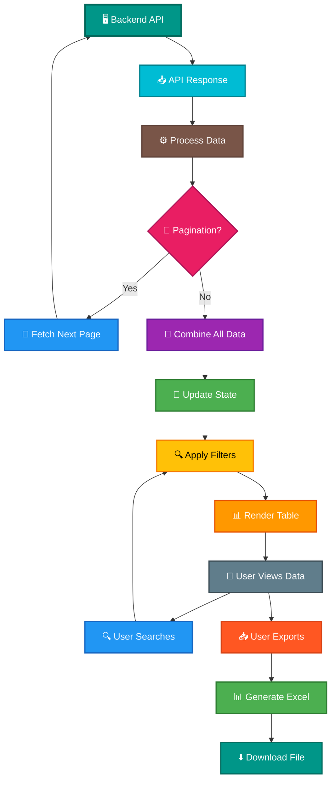
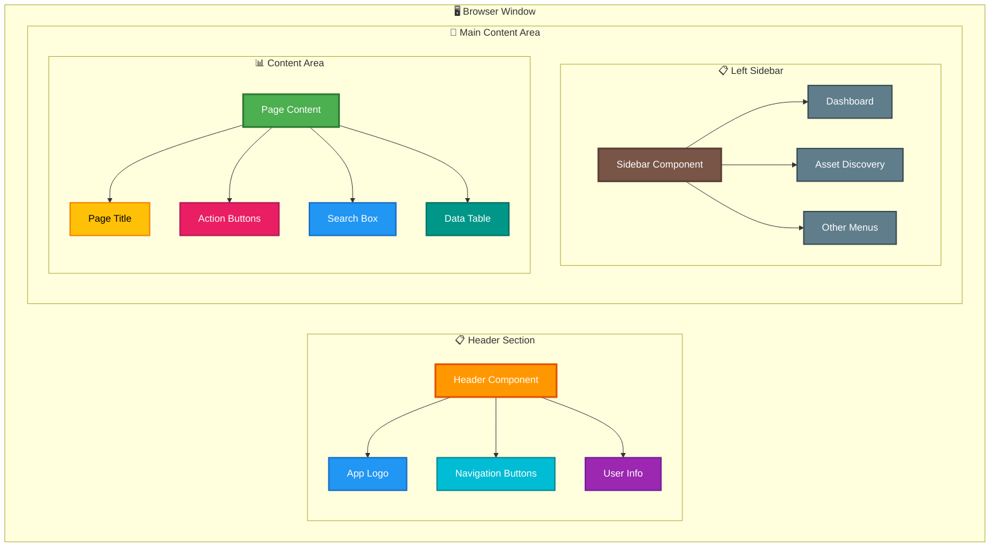
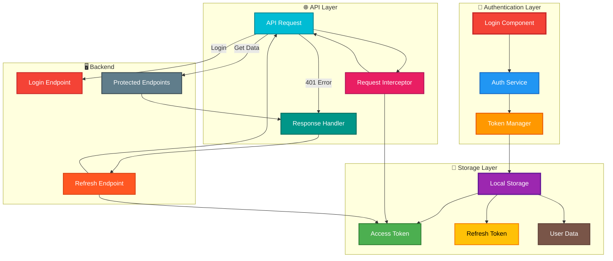
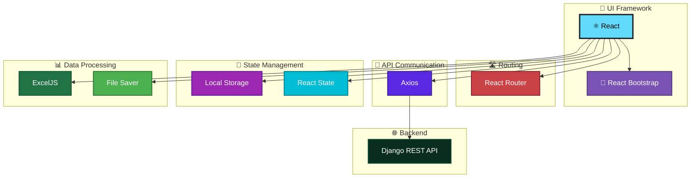
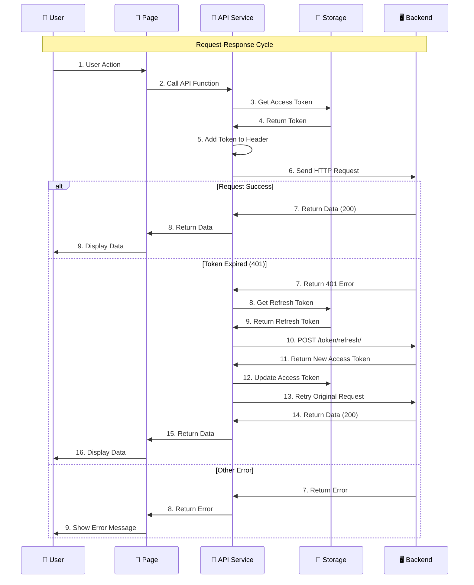

# Frontend Architecture Diagram - Client Presentation

## 🏗️ Application Architecture Overview

### High-Level Architecture

---

## 📦 Component Architecture

### Component Structure

```mermaid
graph TD
    App[🚀 App Component]:::app
    
    App --> Header[📋 Header]:::header
    App --> Router[🛣️ React Router]:::router
    
    Router --> Welcome[👋 Welcome Page]:::welcome
    Router --> Login[🔐 Login Page]:::login
    Router --> SignUp[📝 Sign Up Page]:::signup
    Router --> Dashboard[📊 Dashboard Page]:::dashboard
    Router --> Subdomains[👣 Subdomains Page]:::subdomains
    Router --> Endpoints[🗺️ Endpoints Page]:::endpoints
    Router --> OpenPorts[🔌 Open Ports Page]:::openports
    Router --> Directories[📁 Directories Page]:::directories
    Router --> Technologies[🔧 Technologies Page]:::technologies
    Router --> SSL[🔒 SSL Certificate Page]:::ssl
    
    Dashboard --> Sidebar[📋 Sidebar Component]:::sidebar
    Subdomains --> Sidebar
    Endpoints --> Sidebar
    OpenPorts --> Sidebar
    Directories --> Sidebar
    Technologies --> Sidebar
    SSL --> Sidebar
    
    Login --> APIService[🔌 API Service]:::api
    SignUp --> APIService
    Dashboard --> APIService
    Subdomains --> APIService
    Endpoints --> APIService
    OpenPorts --> APIService
    Directories --> APIService
    Technologies --> APIService
    
    APIService --> Storage[💾 Local Storage]:::storage
    APIService --> Backend[🖥️ Backend API]:::backend
    
    classDef app fill:#E91E63,stroke:#AD1457,stroke-width:4px,color:#fff
    classDef header fill:#FF9800,stroke:#E65100,stroke-width:3px,color:#fff
    classDef router fill:#2196F3,stroke:#1565C0,stroke-width:3px,color:#fff
    classDef welcome fill:#4CAF50,stroke:#2E7D32,stroke-width:2px,color:#fff
    classDef login fill:#F44336,stroke:#C62828,stroke-width:2px,color:#fff
    classDef signup fill:#9C27B0,stroke:#6A1B9A,stroke-width:2px,color:#fff
    classDef dashboard fill:#FF9800,stroke:#E65100,stroke-width:2px,color:#fff
    classDef subdomains fill:#2196F3,stroke:#1565C0,stroke-width:2px,color:#fff
    classDef endpoints fill:#00BCD4,stroke:#00838F,stroke-width:2px,color:#fff
    classDef openports fill:#4CAF50,stroke:#2E7D32,stroke-width:2px,color:#fff
    classDef directories fill:#FFC107,stroke:#F57C00,stroke-width:2px,color:#000
    classDef technologies fill:#FF5722,stroke:#D84315,stroke-width:2px,color:#fff
    classDef ssl fill:#9C27B0,stroke:#6A1B9A,stroke-width:2px,color:#fff
    classDef sidebar fill:#795548,stroke:#5D4037,stroke-width:2px,color:#fff
    classDef api fill:#607D8B,stroke:#37474F,stroke-width:2px,color:#fff
    classDef storage fill:#9C27B0,stroke:#6A1B9A,stroke-width:2px,color:#fff
    classDef backend fill:#009688,stroke:#00695C,stroke-width:2px,color:#fff
```

---

## 🔌 API Integration Architecture

### API Service Layer

---

## 📊 Data Flow Architecture

### Data Flow from Backend to UI

---

## 🎨 UI Layout Architecture

### Page Layout Structure

---

## 🔐 Authentication Architecture

### Authentication Flow Architecture

---

## 📱 Component Hierarchy

### Detailed Component Tree

```mermaid
graph TD
    App[🚀 App]:::app
    
    App --> Header[📋 Header]:::header
    App --> Router[🛣️ Router]:::router
    
    Router --> Welcome[Welcome]:::page
    Router --> Login[Login]:::page
    Router --> SignUp[SignUp]:::page
    Router --> Dashboard[Dashboard]:::page
    Router --> Subdomains[Subdomains]:::page
    Router --> Endpoints[Endpoints]:::page
    Router --> OpenPorts[OpenPorts]:::page
    Router --> Directories[Directories]:::page
    Router --> Technologies[Technologies]:::page
    Router --> SSL[SSL Certificate]:::page
    
    Dashboard --> Sidebar[Sidebar]:::component
    Subdomains --> Sidebar
    Endpoints --> Sidebar
    OpenPorts --> Sidebar
    Directories --> Sidebar
    Technologies --> Sidebar
    SSL --> Sidebar
    
    Dashboard --> Stats[Statistics Cards]:::component
    Dashboard --> Table[Vulnerabilities Table]:::component
    Dashboard --> Actions[Quick Actions]:::component
    
    Subdomains --> Search[Search Box]:::component
    Subdomains --> DataTable[Data Table]:::component
    Subdomains --> Export[Export Button]:::component
    Subdomains --> Modal[Modal]:::component
    
    Endpoints --> Search
    Endpoints --> DataTable
    Endpoints --> Export
    Endpoints --> Modal
    
    OpenPorts --> Search
    OpenPorts --> DataTable
    OpenPorts --> Export
    OpenPorts --> Modal
    
    Directories --> Search
    Directories --> DataTable
    Directories --> Export
    
    Technologies --> Search
    Technologies --> DataTable
    Technologies --> Export
    Technologies --> Modal
    
    classDef app fill:#E91E63,stroke:#AD1457,stroke-width:4px,color:#fff
    classDef header fill:#FF9800,stroke:#E65100,stroke-width:3px,color:#fff
    classDef router fill:#2196F3,stroke:#1565C0,stroke-width:3px,color:#fff
    classDef page fill:#4CAF50,stroke:#2E7D32,stroke-width:2px,color:#fff
    classDef component fill:#00BCD4,stroke:#00838F,stroke-width:2px,color:#fff
```

---

## 🛠️ Technology Stack Architecture

### Frontend Technology Stack

---

## 🔄 Request-Response Cycle

### Complete Request Cycle

---

## 📊 Data Processing Architecture

### Data Processing Pipeline

```mermaid
flowchart LR
    Backend[🖥️ Backend API]:::backend
    Backend --> Raw[📥 Raw JSON Data]:::raw
    
    Raw --> Parse[🔍 Parse Data]:::parse
    Parse --> Validate[✅ Validate Data]:::validate
    
    Validate -->|Valid| Transform[🔄 Transform Data]:::transform
    Validate -->|Invalid| Error[❌ Handle Error]:::error
    
    Transform --> Paginate[📄 Handle Pagination]:::paginate
    Paginate --> Combine[🔗 Combine Pages]:::combine
    
    Combine --> Filter[🔍 Apply Filters]:::filter
    Filter --> Sort[📊 Sort Data]:::sort
    
    Sort --> Display[📊 Display in UI]:::display
    
    Display --> User[👤 User Interaction]:::user
    User --> Export[📥 Export Request]:::export
    Export --> Format[📋 Format for Excel]:::format
    Format --> Generate[⚙️ Generate File]:::generate
    Generate --> Download[⬇️ Download]:::download
    
    classDef backend fill:#009688,stroke:#00695C,stroke-width:3px,color:#fff
    classDef raw fill:#00BCD4,stroke:#00838F,stroke-width:2px,color:#fff
    classDef parse fill:#2196F3,stroke:#1565C0,stroke-width:2px,color:#fff
    classDef validate fill:#FFC107,stroke:#F57C00,stroke-width:2px,color:#000
    classDef transform fill:#9C27B0,stroke:#6A1B9A,stroke-width:2px,color:#fff
    classDef error fill:#F44336,stroke:#C62828,stroke-width:2px,color:#fff
    classDef paginate fill:#E91E63,stroke:#AD1457,stroke-width:2px,color:#fff
    classDef combine fill:#795548,stroke:#5D4037,stroke-width:2px,color:#fff
    classDef filter fill:#FF9800,stroke:#E65100,stroke-width:2px,color:#fff
    classDef sort fill:#607D8B,stroke:#37474F,stroke-width:2px,color:#fff
    classDef display fill:#4CAF50,stroke:#2E7D32,stroke-width:2px,color:#fff
    classDef user fill:#9C27B0,stroke:#6A1B9A,stroke-width:2px,color:#fff
    classDef export fill:#FF5722,stroke:#D84315,stroke-width:2px,color:#fff
    classDef format fill:#009688,stroke:#00695C,stroke-width:2px,color:#fff
    classDef generate fill:#00BCD4,stroke:#00838F,stroke-width:2px,color:#fff
    classDef download fill:#4CAF50,stroke:#2E7D32,stroke-width:2px,color:#fff
```

---

## 🎨 Color Legend for Architecture

### Architecture Diagram Colors

| Color | Component Type | Examples |
|-------|---------------|----------|
| 🟢 **Green** | Data/Storage | Data display, storage, success states |
| 🔵 **Blue** | Core Components | React, routing, API services |
| 🟠 **Orange** | UI Components | Header, dashboard, important UI |
| 🔴 **Red** | Authentication | Login, errors, security |
| 🟣 **Purple** | Storage/State | Local storage, state management |
| 🟡 **Yellow** | Processing | Data processing, validation |
| ⚫ **Gray** | Backend | Django, database, server |
| 🟤 **Brown** | Navigation | Sidebar, menus, navigation |
| 🔷 **Cyan** | Services | API services, utilities |
| 🔶 **Pink** | User Interaction | User actions, interactions |

---

## 📝 Key Architecture Points for Client

### 1. **Modular Design**
- Separate components for each feature
- Reusable components across pages
- Clean separation of concerns

### 2. **API Integration**
- Centralized API service
- Automatic token management
- Error handling built-in

### 3. **State Management**
- React state for UI
- Local storage for persistence
- Automatic synchronization

### 4. **Security**
- Token-based authentication
- Secure storage
- Auto-refresh mechanism

### 5. **User Experience**
- Fast loading with pagination
- Real-time search
- Easy data export

### 6. **Scalability**
- Component-based architecture
- Easy to add new pages
- Modular API integration

---

**Document Purpose:** Client-friendly architecture diagrams for frontend application  
**Last Updated:** 2024
