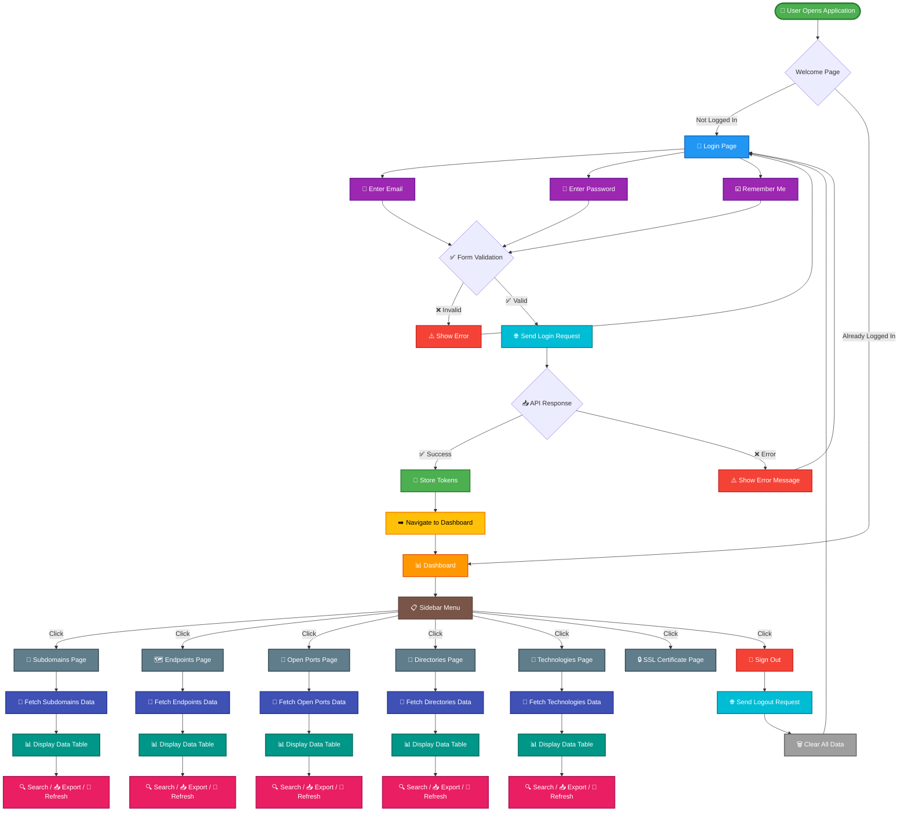
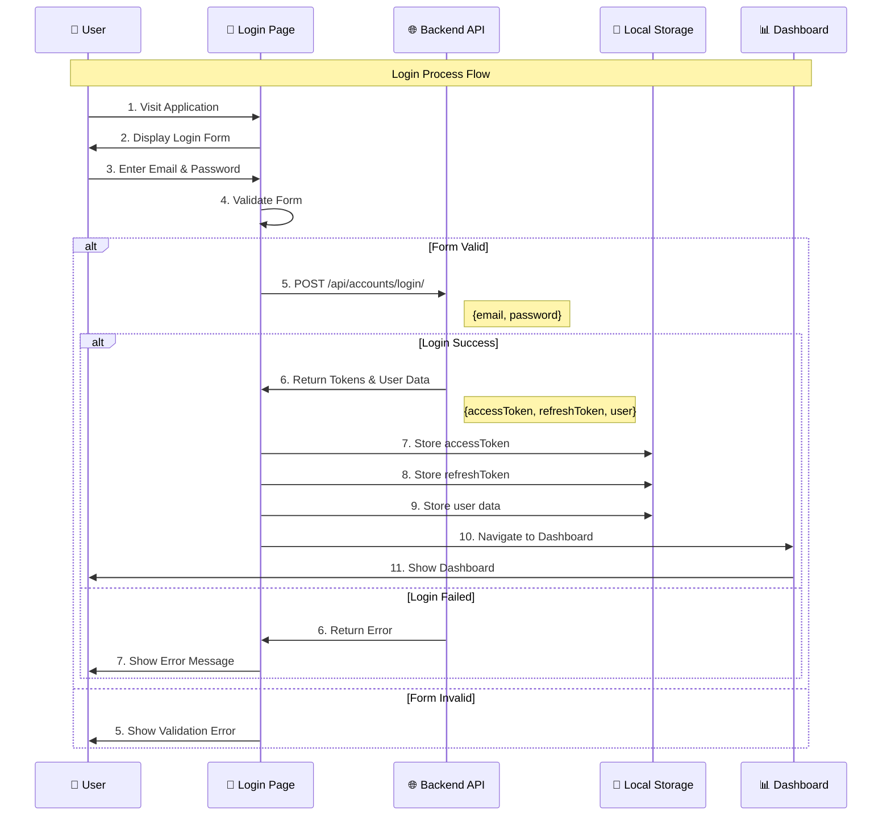
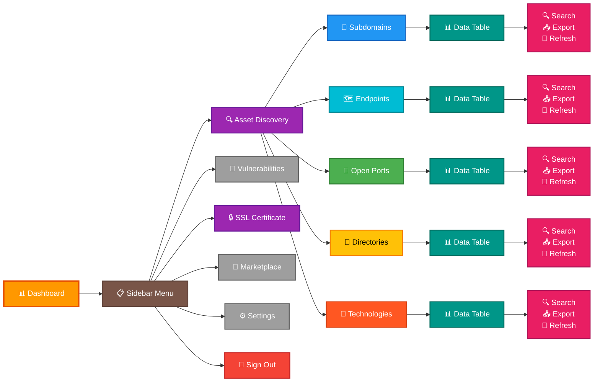
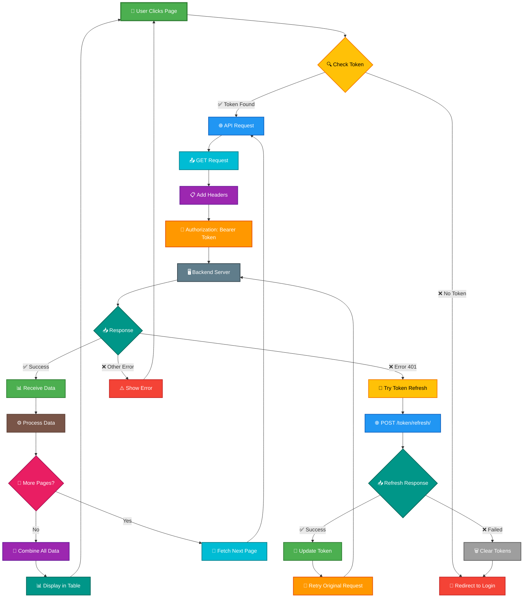
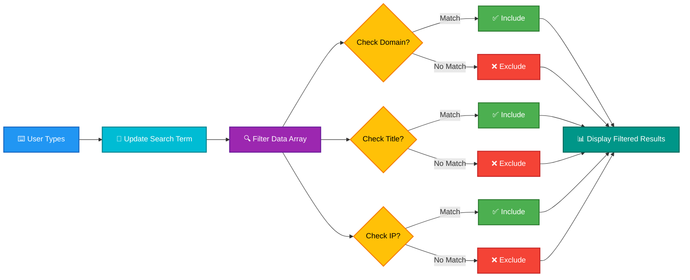
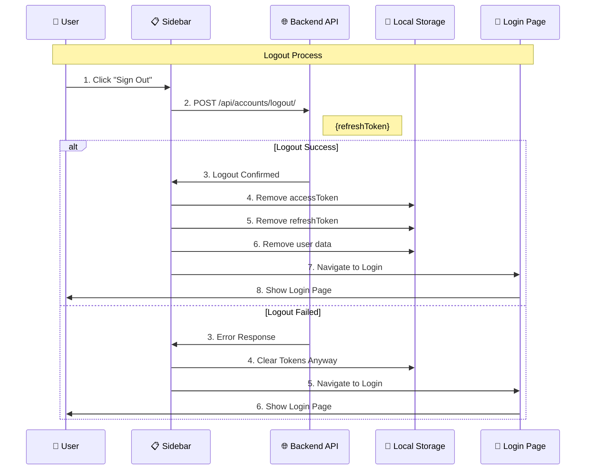
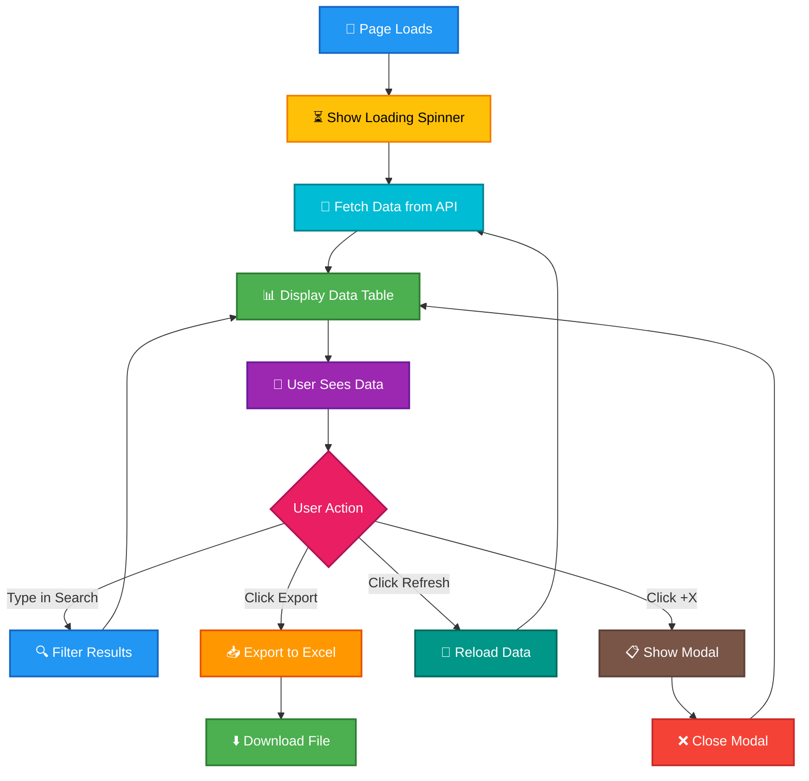

# Frontend Flow Diagram - Client Presentation

## 🎯 Application User Flow

### Complete User Journey Flow



---

## 🔐 Login Process Flow

### Detailed Login Flow



---

## 📊 Dashboard to Pages Flow

### Navigation Flow from Dashboard



---

## 🔄 Data Fetching Flow

### How Data is Loaded on Each Page



---

## 🔍 Search & Filter Flow

### How Search Works



---

## 📥 Export to Excel Flow

### Excel Export Process

```mermaid
flowchart TD
    Click[👆 User Clicks Export]:::click
    Click --> Create[📝 Create Excel Workbook]:::create
    
    Create --> Worksheet[📋 Add Worksheet]:::worksheet
    Worksheet --> Headers[📑 Set Column Headers]:::headers
    
    Headers --> Loop[🔄 Loop Through Data]:::loop
    Loop --> Row[📊 Add Row]:::row
    
    Row --> Format[✨ Format Values]:::format
    Format --> More{More Rows?}:::more
    
    More -->|Yes| Loop
    More -->|No| Style[🎨 Style Header Row]:::style
    
    Style --> Generate[⚙️ Generate Buffer]:::generate
    Generate --> Blob[📦 Create Blob]:::blob
    Blob --> Download[⬇️ Download File]:::download
    Download --> Done[✅ Complete]:::done
    
    classDef click fill:#2196F3,stroke:#1565C0,stroke-width:2px,color:#fff
    classDef create fill:#4CAF50,stroke:#2E7D32,stroke-width:2px,color:#fff
    classDef worksheet fill:#00BCD4,stroke:#00838F,stroke-width:2px,color:#fff
    classDef headers fill:#9C27B0,stroke:#6A1B9A,stroke-width:2px,color:#fff
    classDef loop fill:#FF9800,stroke:#E65100,stroke-width:2px,color:#fff
    classDef row fill:#607D8B,stroke:#37474F,stroke-width:2px,color:#fff
    classDef format fill:#FFC107,stroke:#F57C00,stroke-width:2px,color:#000
    classDef more fill:#E91E63,stroke:#AD1457,stroke-width:2px,color:#fff
    classDef style fill:#795548,stroke:#5D4037,stroke-width:2px,color:#fff
    classDef generate fill:#009688,stroke:#00695C,stroke-width:2px,color:#fff
    classDef blob fill:#FF5722,stroke:#D84315,stroke-width:2px,color:#fff
    classDef download fill:#4CAF50,stroke:#2E7D32,stroke-width:2px,color:#fff
    classDef done fill:#4CAF50,stroke:#2E7D32,stroke-width:3px,color:#fff
```

---

## 🚪 Logout Flow

### Sign Out Process



---

## 📱 Page Interaction Flow

### User Interaction on Data Pages



---

## 🎨 Color Legend

### Flow Diagram Colors Meaning

| Color | Meaning | Used For |
|-------|---------|----------|
| 🟢 **Green** | Success, Completion | Successful operations, data display, done states |
| 🔵 **Blue** | Information, Process | API calls, data fetching, navigation |
| 🟠 **Orange** | Warning, Important | Dashboard, important actions |
| 🔴 **Red** | Error, Danger | Errors, logout, clear actions |
| 🟣 **Purple** | Input, User Action | User inputs, forms, menus |
| 🟡 **Yellow** | Warning, Check | Validation, checks, warnings |
| ⚫ **Gray** | Neutral, Placeholder | Placeholder items, neutral states |
| 🟤 **Brown** | Sidebar, Menu | Navigation, sidebar elements |
| 🔷 **Cyan** | Data Processing | Data processing, formatting |
| 🔶 **Pink** | Actions, Interactions | User actions, interactions |

---

## 📝 Key Points for Client Presentation

### 1. **Login Flow**
- Simple 3-step process: Enter credentials → API call → Dashboard
- Secure token storage
- Automatic error handling

### 2. **Navigation**
- Easy sidebar navigation
- All pages accessible from one menu
- Clear visual indicators

### 3. **Data Display**
- Real-time data from backend
- Automatic pagination
- Clean table presentation

### 4. **User Actions**
- Search: Instant filtering
- Export: One-click Excel download
- Refresh: Reload latest data

### 5. **Security**
- Token-based authentication
- Auto-refresh on expiry
- Secure logout

---

**Document Purpose:** Client-friendly flow diagrams for frontend application  
**Last Updated:** 2024
