# Frontend Complete Diagrams - Flow & Architecture

## 📋 Table of Contents
1. [Flow Diagrams](#flow-diagrams)
2. [Architecture Diagrams](#architecture-diagrams)

---

# 🎯 FLOW DIAGRAMS

## Complete User Journey Flow

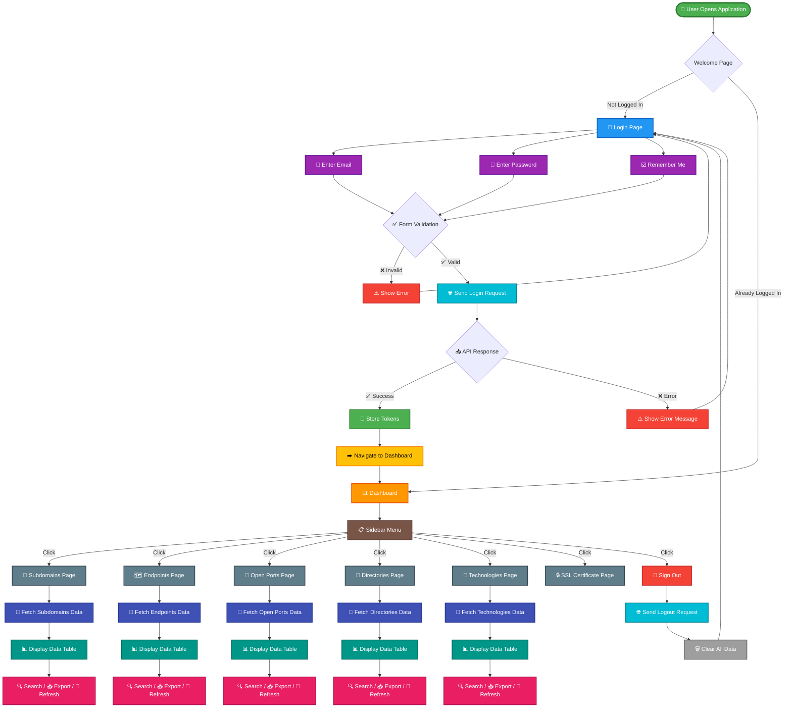

---

## Login Process Flow

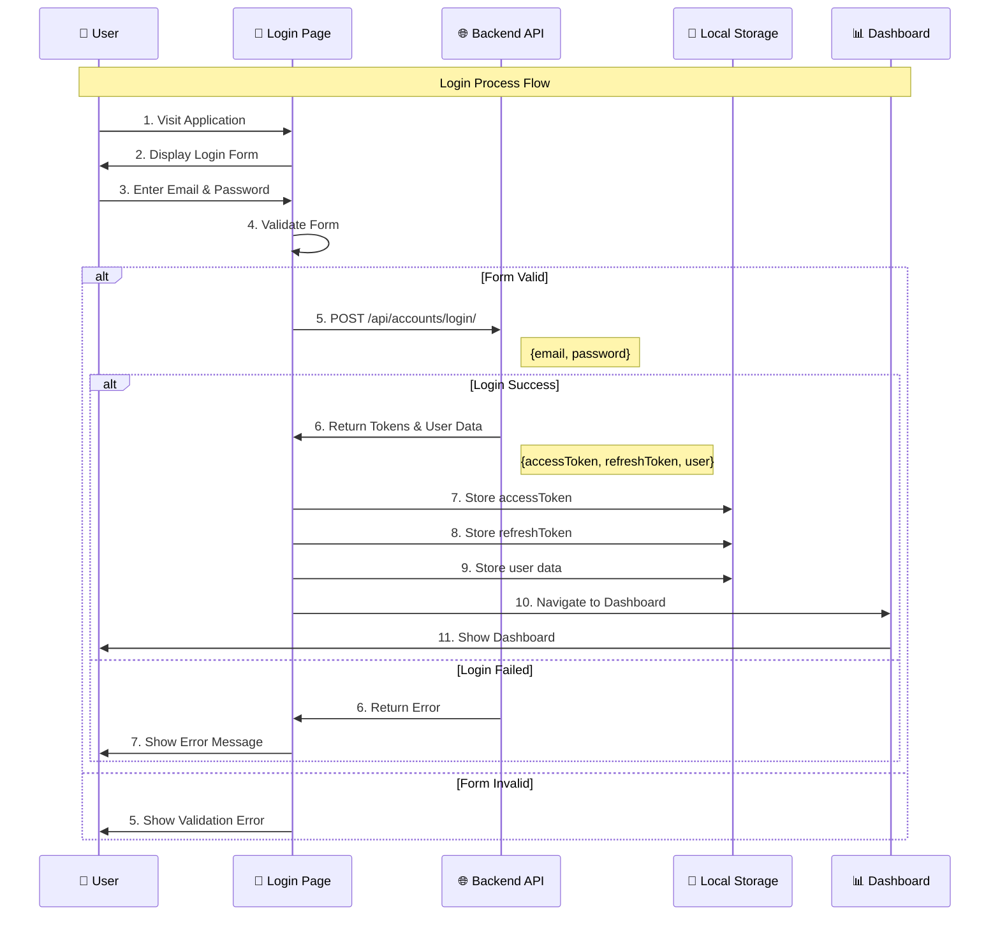

---

## Dashboard to Pages Navigation Flow

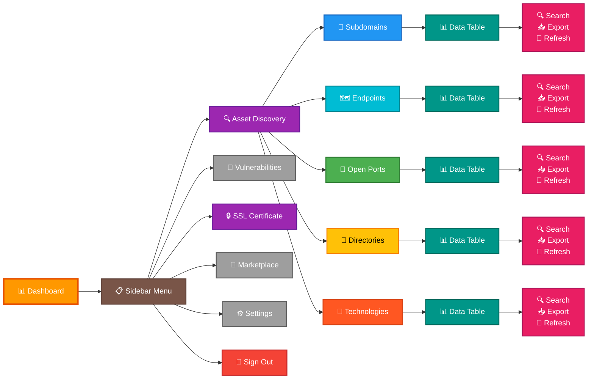

---

## Data Fetching Flow

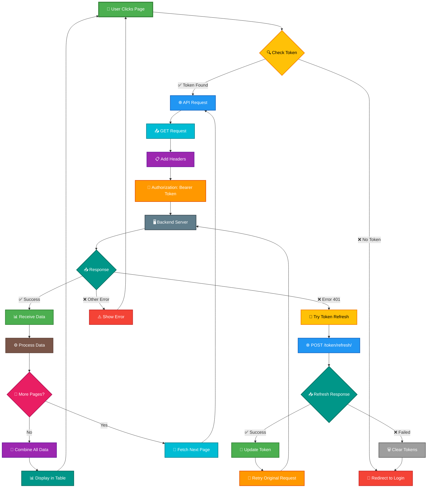

---

## Search & Filter Flow

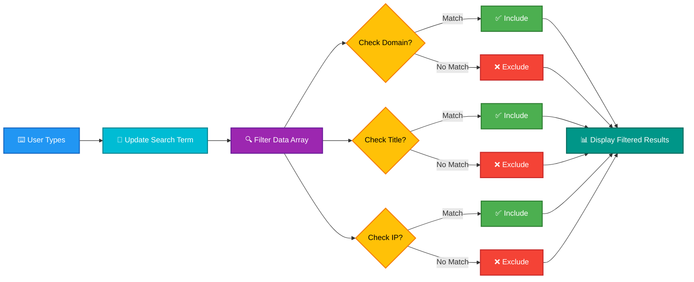

---

## Export to Excel Flow

```mermaid
flowchart TD
    Click[👆 User Clicks Export]:::click
    Click --> Create[📝 Create Excel Workbook]:::create
    
    Create --> Worksheet[📋 Add Worksheet]:::worksheet
    Worksheet --> Headers[📑 Set Column Headers]:::headers
    
    Headers --> Loop[🔄 Loop Through Data]:::loop
    Loop --> Row[📊 Add Row]:::row
    
    Row --> Format[✨ Format Values]:::format
    Format --> More{More Rows?}:::more
    
    More -->|Yes| Loop
    More -->|No| Style[🎨 Style Header Row]:::style
    
    Style --> Generate[⚙️ Generate Buffer]:::generate
    Generate --> Blob[📦 Create Blob]:::blob
    Blob --> Download[⬇️ Download File]:::download
    Download --> Done[✅ Complete]:::done
    
    classDef click fill:#2196F3,stroke:#1565C0,stroke-width:2px,color:#fff
    classDef create fill:#4CAF50,stroke:#2E7D32,stroke-width:2px,color:#fff
    classDef worksheet fill:#00BCD4,stroke:#00838F,stroke-width:2px,color:#fff
    classDef headers fill:#9C27B0,stroke:#6A1B9A,stroke-width:2px,color:#fff
    classDef loop fill:#FF9800,stroke:#E65100,stroke-width:2px,color:#fff
    classDef row fill:#607D8B,stroke:#37474F,stroke-width:2px,color:#fff
    classDef format fill:#FFC107,stroke:#F57C00,stroke-width:2px,color:#000
    classDef more fill:#E91E63,stroke:#AD1457,stroke-width:2px,color:#fff
    classDef style fill:#795548,stroke:#5D4037,stroke-width:2px,color:#fff
    classDef generate fill:#009688,stroke:#00695C,stroke-width:2px,color:#fff
    classDef blob fill:#FF5722,stroke:#D84315,stroke-width:2px,color:#fff
    classDef download fill:#4CAF50,stroke:#2E7D32,stroke-width:2px,color:#fff
    classDef done fill:#4CAF50,stroke:#2E7D32,stroke-width:3px,color:#fff
```

---

# 🏗️ ARCHITECTURE DIAGRAMS

## High-Level Architecture Overview

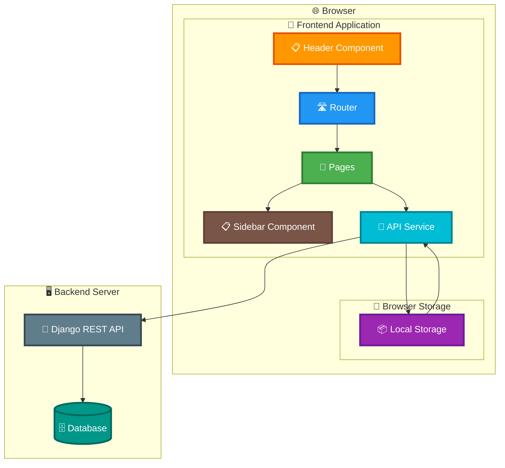

---

## Component Architecture

```mermaid
graph TD
    App[🚀 App Component]:::app
    
    App --> Header[📋 Header]:::header
    App --> Router[🛣️ React Router]:::router
    
    Router --> Welcome[👋 Welcome Page]:::welcome
    Router --> Login[🔐 Login Page]:::login
    Router --> SignUp[📝 Sign Up Page]:::signup
    Router --> Dashboard[📊 Dashboard Page]:::dashboard
    Router --> Subdomains[👣 Subdomains Page]:::subdomains
    Router --> Endpoints[🗺️ Endpoints Page]:::endpoints
    Router --> OpenPorts[🔌 Open Ports Page]:::openports
    Router --> Directories[📁 Directories Page]:::directories
    Router --> Technologies[🔧 Technologies Page]:::technologies
    Router --> SSL[🔒 SSL Certificate Page]:::ssl
    
    Dashboard --> Sidebar[📋 Sidebar Component]:::sidebar
    Subdomains --> Sidebar
    Endpoints --> Sidebar
    OpenPorts --> Sidebar
    Directories --> Sidebar
    Technologies --> Sidebar
    SSL --> Sidebar
    
    Login --> APIService[🔌 API Service]:::api
    SignUp --> APIService
    Dashboard --> APIService
    Subdomains --> APIService
    Endpoints --> APIService
    OpenPorts --> APIService
    Directories --> APIService
    Technologies --> APIService
    
    APIService --> Storage[💾 Local Storage]:::storage
    APIService --> Backend[🖥️ Backend API]:::backend
    
    classDef app fill:#E91E63,stroke:#AD1457,stroke-width:4px,color:#fff
    classDef header fill:#FF9800,stroke:#E65100,stroke-width:3px,color:#fff
    classDef router fill:#2196F3,stroke:#1565C0,stroke-width:3px,color:#fff
    classDef welcome fill:#4CAF50,stroke:#2E7D32,stroke-width:2px,color:#fff
    classDef login fill:#F44336,stroke:#C62828,stroke-width:2px,color:#fff
    classDef signup fill:#9C27B0,stroke:#6A1B9A,stroke-width:2px,color:#fff
    classDef dashboard fill:#FF9800,stroke:#E65100,stroke-width:2px,color:#fff
    classDef subdomains fill:#2196F3,stroke:#1565C0,stroke-width:2px,color:#fff
    classDef endpoints fill:#00BCD4,stroke:#00838F,stroke-width:2px,color:#fff
    classDef openports fill:#4CAF50,stroke:#2E7D32,stroke-width:2px,color:#fff
    classDef directories fill:#FFC107,stroke:#F57C00,stroke-width:2px,color:#000
    classDef technologies fill:#FF5722,stroke:#D84315,stroke-width:2px,color:#fff
    classDef ssl fill:#9C27B0,stroke:#6A1B9A,stroke-width:2px,color:#fff
    classDef sidebar fill:#795548,stroke:#5D4037,stroke-width:2px,color:#fff
    classDef api fill:#607D8B,stroke:#37474F,stroke-width:2px,color:#fff
    classDef storage fill:#9C27B0,stroke:#6A1B9A,stroke-width:2px,color:#fff
    classDef backend fill:#009688,stroke:#00695C,stroke-width:2px,color:#fff
```

---

## API Integration Architecture

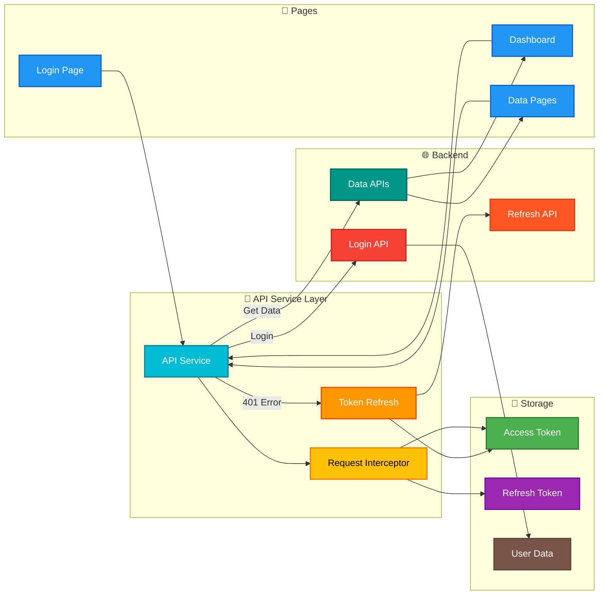

---

## Data Flow Architecture

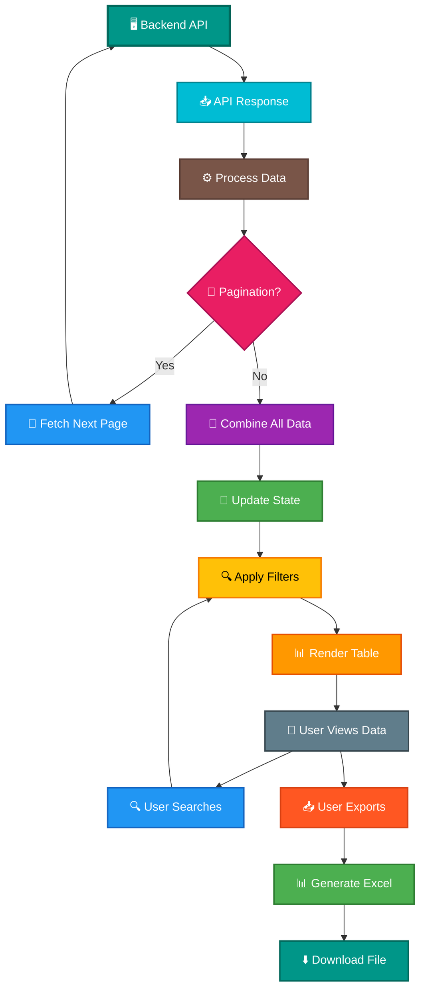

---

## UI Layout Architecture

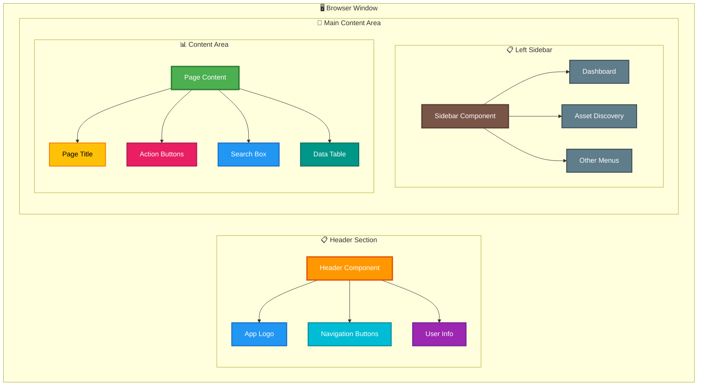

---

## Authentication Architecture

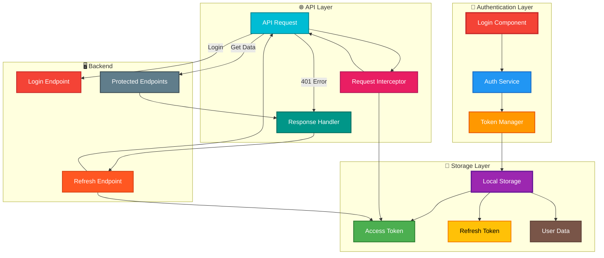

---

## Technology Stack Architecture

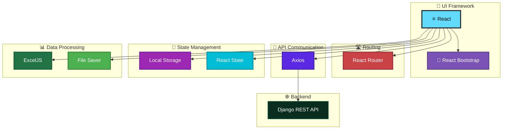

---

## Request-Response Cycle

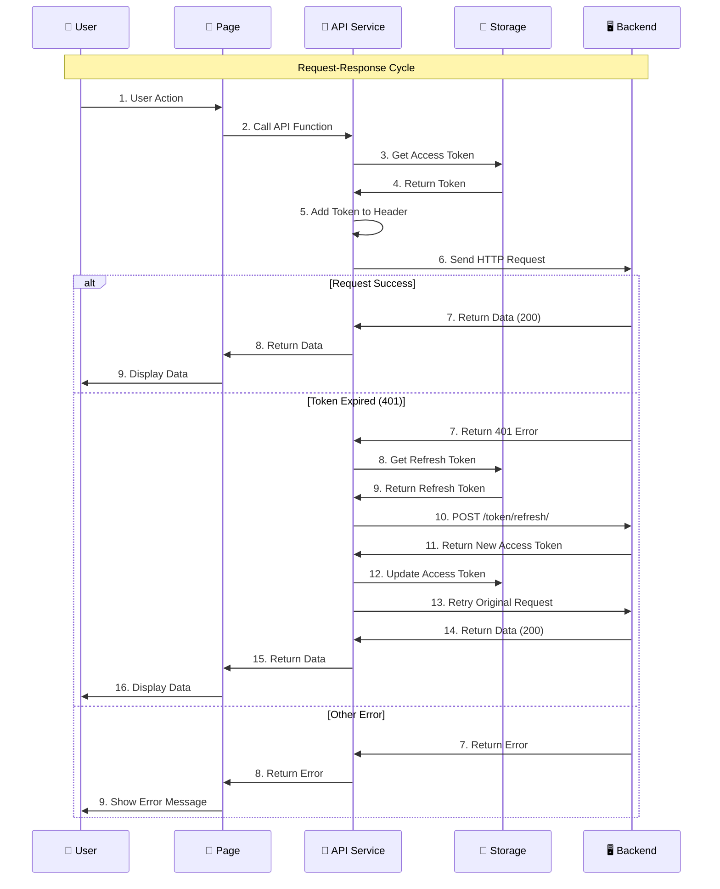

---

## 🎨 Color Legend

### Flow Diagram Colors
| Color | Meaning | Used For |
|-------|---------|----------|
| 🟢 **Green** | Success, Completion | Successful operations, data display |
| 🔵 **Blue** | Information, Process | API calls, data fetching, navigation |
| 🟠 **Orange** | Warning, Important | Dashboard, important actions |
| 🔴 **Red** | Error, Danger | Errors, logout, security |
| 🟣 **Purple** | Input, User Action | User inputs, forms, storage |
| 🟡 **Yellow** | Warning, Check | Validation, checks |
| ⚫ **Gray** | Neutral | Placeholder items, backend |
| 🟤 **Brown** | Navigation | Sidebar, menus |
| 🔷 **Cyan** | Data Processing | Data processing, formatting |
| 🔶 **Pink** | Actions | User interactions |

### Architecture Diagram Colors
| Color | Component Type | Examples |
|-------|---------------|----------|
| 🟢 **Green** | Data/Storage | Data display, storage |
| 🔵 **Blue** | Core Components | React, routing, API |
| 🟠 **Orange** | UI Components | Header, dashboard |
| 🔴 **Red** | Authentication | Login, security |
| 🟣 **Purple** | Storage/State | Local storage, state |
| 🟡 **Yellow** | Processing | Data processing |
| ⚫ **Gray** | Backend | Django, database |
| 🟤 **Brown** | Navigation | Sidebar, menus |
| 🔷 **Cyan** | Services | API services |
| 🔶 **Pink** | User Interaction | User actions |

---

## 📝 Key Points for Client Presentation

### Flow Diagrams Show:
1. **User Journey** - Complete flow from login to data viewing
2. **Login Process** - Step-by-step authentication
3. **Navigation** - How users move between pages
4. **Data Fetching** - How data is loaded and displayed
5. **User Actions** - Search, export, refresh functionality

### Architecture Diagrams Show:
1. **System Structure** - How components are organized
2. **Component Hierarchy** - Parent-child relationships
3. **API Integration** - How frontend connects to backend
4. **Data Flow** - How data moves through the system
5. **Technology Stack** - Technologies used

---

**Document Purpose:** Complete flow and architecture diagrams for frontend application  
**Last Updated:** 2024
