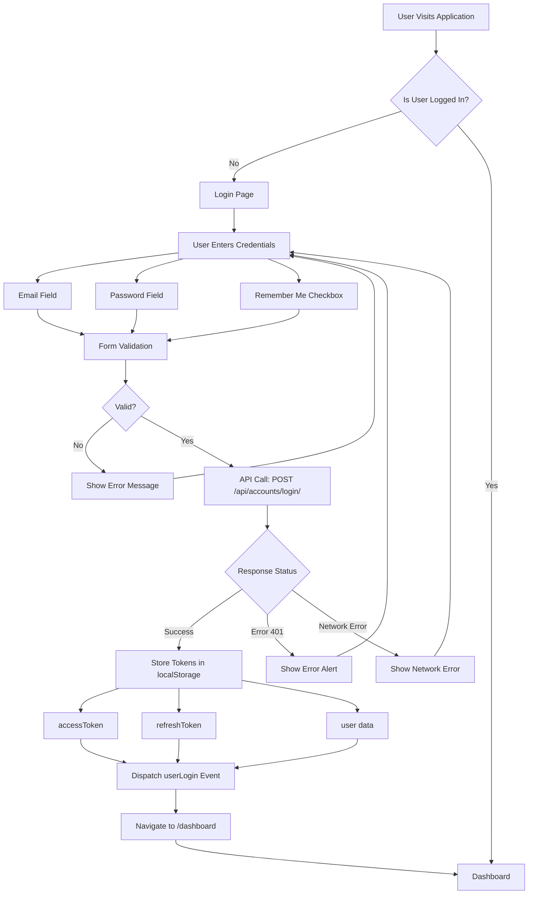
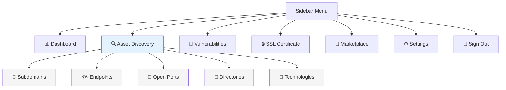
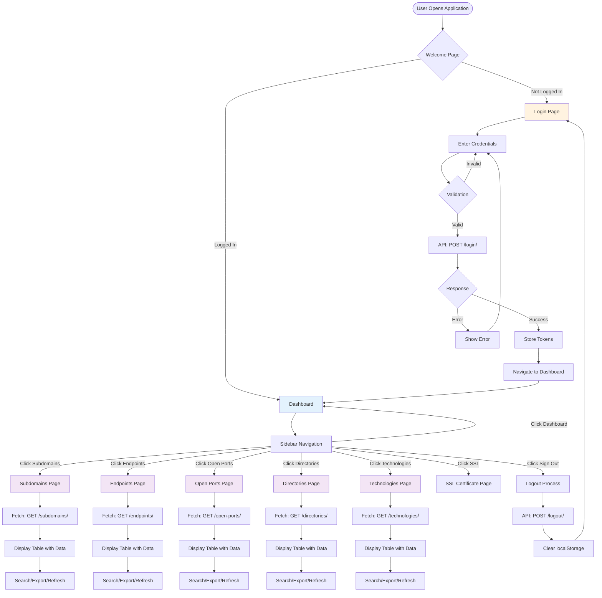
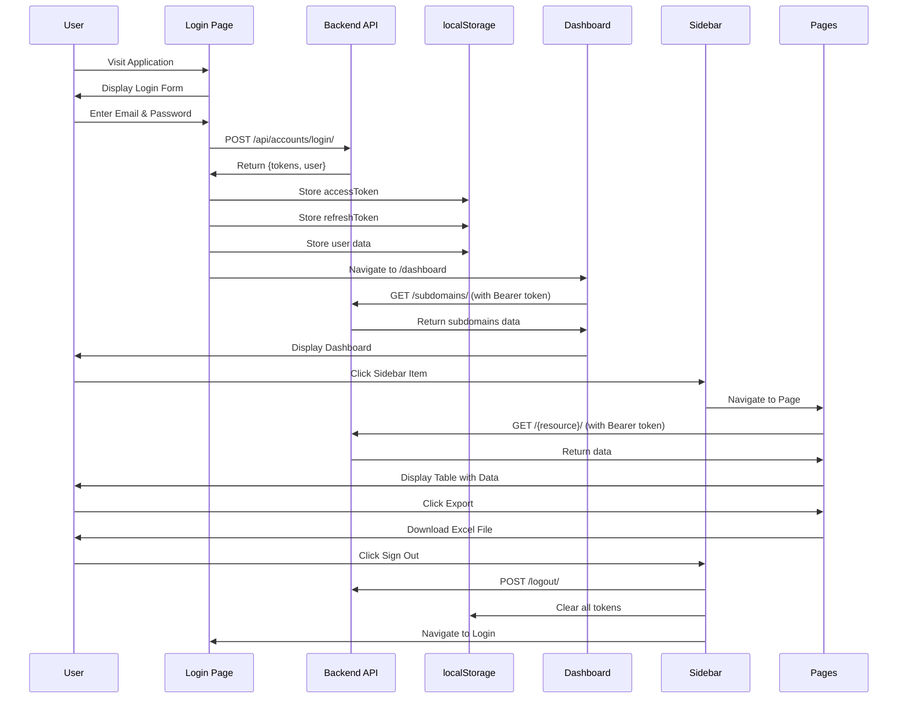
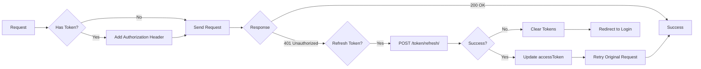

# Frontend Flow Diagram & Documentation

## 📋 Table of Contents
1. [Application Overview](#application-overview)
2. [Login Flow](#login-flow)
3. [Sidebar Structure](#sidebar-structure)
4. [Page Data Structure](#page-data-structure)
5. [Complete Application Flow](#complete-application-flow)
6. [API Integration](#api-integration)

---

## 🎯 Application Overview

**Application Name:** Infotech Sentinel  
**Technology Stack:** React, React Router, React Bootstrap, Axios  
**Backend API:** Django REST Framework (http://127.0.0.1:8000)

### Main Features:
- User Authentication (Login/Signup)
- Dashboard Overview
- Asset Discovery (Subdomains, Endpoints, Open Ports, Directories, Technologies)
- SSL Certificate Management
- Vulnerability Tracking

---

## 🔐 Login Flow

### Login Flow Diagram



### Login Page Fields

| Field | Type | Required | Description |
|-------|------|----------|-------------|
| **Email Address** | email | ✅ Yes | User's email address (e.g., example@position) |
| **Password** | password | ✅ Yes | User's password (masked input) |
| **Remember Me** | checkbox | ❌ No | Option to remember user session |
| **Forgot Password** | link | ❌ No | Link to password recovery (not implemented) |

### Login Process Steps

1. **User Input**
   - User enters email and password
   - Optional: Check "Remember me"

2. **Form Submission**
   - Form validation runs
   - Loading state activated

3. **API Request**
   - POST request to: `http://127.0.0.1:8000/api/accounts/login/`
   - Payload: `{ email, password }`
   - Headers: `Content-Type: application/json`

4. **Response Handling**
   - **Success (200):**
     - Store `accessToken` in localStorage
     - Store `refreshToken` in localStorage
     - Store `user` object in localStorage
     - Dispatch `userLogin` event
     - Navigate to `/dashboard`
   
   - **Error (401/400):**
     - Display error message
     - Keep user on login page

5. **Token Management**
   - Access token attached to all subsequent API requests
   - Auto-refresh on 401 errors
   - Redirect to login if refresh fails

---

## 📊 Sidebar Structure

### Sidebar Navigation Menu



### Sidebar Menu Items

| Icon | Menu Item | Route | Status | Description |
|------|-----------|-------|--------|-------------|
| 📊 | **Dashboard** | `/dashboard` | ✅ Active | Main overview page with statistics |
| 🔍 | **Asset Discovery** | Collapsible | ✅ Active | Parent menu for discovery tools |
| 👣 | **Subdomains** | `/subdomains` | ✅ Active | View discovered subdomains |
| 🗺️ | **Endpoints** | `/endpoints` | ✅ Active | View HTTP endpoints |
| 🔌 | **Open Ports** | `/open-ports` | ✅ Active | View open ports on domains |
| 📁 | **Directories** | `/directories` | ✅ Active | View discovered directories |
| 🔧 | **Technologies** | `/technologies` | ✅ Active | View detected technologies |
| 🐞 | **Vulnerabilities** | `#` | ⚠️ Placeholder | Not implemented yet |
| 🔒 | **SSL Certificate** | `/ssl-certificates` | ✅ Active | SSL certificate information |
| 🛒 | **Marketplace** | `#` | ⚠️ Placeholder | Not implemented yet |
| ⚙️ | **Settings** | `#` | ⚠️ Placeholder | Not implemented yet |
| 🚪 | **Sign Out** | Logout | ✅ Active | Logout functionality |

### Sidebar Features

- **Collapsible Menu:** Asset Discovery can be expanded/collapsed
- **Active State:** Highlights current page
- **Auto-expand:** Asset Discovery auto-expands when on any sub-route
- **Responsive:** Fixed position sidebar (280px width)

---

## 📄 Page Data Structure

### 1. Dashboard Page (`/dashboard`)

#### Data Displayed:

**Statistics Cards:**
- Critical Vulnerabilities: 12
- High Vulnerabilities: 24
- Medium Vulnerabilities: 36
- Low Vulnerabilities: 8

**Recent Vulnerabilities Table:**
| Column | Description |
|--------|-------------|
| Title | Vulnerability name/description |
| Severity | Critical/High/Medium/Low (color-coded badges) |
| Status | Open/Patched |
| Discovered | Time since discovery |
| Actions | View/Edit buttons |

**Quick Actions:**
- Start New Scan
- Generate Report
- Run Security Check

**Recent Activity Feed:**
- New vulnerability detected
- Scan completed notifications
- Update available alerts

---

### 2. Subdomains Page (`/subdomains`)

#### API Endpoint:
`GET http://127.0.0.1:8000/api/attacksurface/subdomains/?org_id={org_id}`

#### Data Fields Displayed:

| Column | Field Name | Type | Description |
|--------|------------|------|-------------|
| S.No | - | number | Sequential number |
| Domain | `domain` | string | Subdomain URL |
| Status | `status` | string/number | Active/Inactive (200-399 = Active) |
| Title | `title` | string | Page title |
| Technologies | `technologies` | array | Detected technologies (max 3 visible, click for more) |
| IP | `ip` | array | IP addresses (max 3 visible, click for more) |
| Ports | `ports` | array | Open ports (max 3 visible, click for more) |
| Screenshot | `screenshot` | string | Screenshot URL |
| Location | `location` | string | Geographic location flag |
| WAF | `waf` | string | Web Application Firewall (or "Yet to Enable") |
| CDN | `cdn` | string | Content Delivery Network (or "Yet to Enable") |
| Created | `created_at` | datetime | Creation date (DD-M-YYYY) |
| Updated | `updated_at` | datetime | Last update date (DD-M-YYYY) |

#### Additional Features:
- **Search:** Filter by domain, title, or IP
- **Export to Excel:** Download all data
- **Refresh:** Reload data from API
- **Modal View:** Click "+X" to see all technologies/IPs/ports
- **Pills:** Show endpoints_count, vulnerabilities_count, content_type

---

### 3. Endpoints Page (`/endpoints`)

#### API Endpoint:
`GET http://127.0.0.1:8000/api/attacksurface/endpoints/?org_id={org_id}`

#### Data Fields Displayed:

| Column | Field Name | Type | Description |
|--------|------------|------|-------------|
| S.No | - | number | Sequential number |
| HTTP URL | `http_url` | string | Full endpoint URL (clickable) |
| Subdomain | `subdomain_name` | string | Associated subdomain |
| Status | `http_status` | number | HTTP status code (200-299 = Active) |
| Technologies | `technologies` | array | Detected technologies (max 3 visible) |
| Title | `title` | string | Page title |
| Content Type | `content_type` | string | MIME type (e.g., text/html) |
| Content Length | `content_length` | number | Response size in bytes |
| Created | `discovered_at` | datetime | Discovery date (DD-M-YYYY) |
| Updated | `last_scan` | datetime | Last scan date (DD-M-YYYY) |

#### Additional Features:
- **Search:** Filter by URL, title, subdomain, content type, or status
- **Export to Excel:** Download all data
- **Status Badges:** Color-coded by HTTP status (2xx=green, 3xx=blue, 4xx=yellow, 5xx=red)
- **Live Status:** Shows "Live" or "Down" badge

---

### 4. Open Ports Page (`/open-ports`)

#### API Endpoint:
`GET http://127.0.0.1:8000/api/attacksurface/open-ports/?org_id={org_id}`

#### Data Fields Displayed:

| Column | Field Name | Type | Description |
|--------|------------|------|-------------|
| S.No | - | number | Sequential number |
| Domain | `domain` | string | Domain name |
| Ports | `ports` | array | List of open ports (max 3 visible, click for more) |
| Created | `created_at` | datetime | Creation date (DD-M-YYYY) |
| Updated | `updated_at` | datetime | Last update date (DD-M-YYYY) |

#### Additional Features:
- **Search:** Filter by domain
- **Export to Excel:** Download all data
- **Modal View:** Click "+X" to see all ports

---

### 5. Directories Page (`/directories`)

#### API Endpoint:
`GET http://127.0.0.1:8000/api/attacksurface/directories/?org_id={org_id}`

#### Data Fields Displayed:

| Column | Field Name | Type | Description |
|--------|------------|------|-------------|
| S.No | - | number | Sequential number |
| URL | `url` | string | Directory URL |
| Subdomain | `subdomain_name` | string | Associated subdomain |
| Content Type | `content_type` | string | MIME type |
| Content Details | `content_details` | string | Additional content information |
| Status | `status` | string | Active/Inactive status |
| Discovered Date | `discovered_date` | datetime | Discovery timestamp |

#### Additional Features:
- **Search:** Filter by URL, subdomain, or content type
- **Export to Excel:** Download all data

---

### 6. Technologies Page (`/technologies`)

#### API Endpoint:
`GET http://127.0.0.1:8000/api/attacksurface/technologies/?org_id={org_id}`

#### Data Fields Displayed:

| Column | Field Name | Type | Description |
|--------|------------|------|-------------|
| S.No | - | number | Sequential number |
| Domain | `domain` | string | Domain name |
| Technologies | `technologies` | array | Detected technologies (max 3 visible, click for more) |
| Created | `created_at` | datetime | Creation date (DD-M-YYYY) |
| Updated | `updated_at` | datetime | Last update date (DD-M-YYYY) |

#### Additional Features:
- **Search:** Filter by domain or technology
- **Export to Excel:** Download all data
- **Modal View:** Click "+X" to see all technologies

---

### 7. SSL Certificate Page (`/ssl-certificates`)

#### Status: Implemented (details not shown in code review)

---

## 🔄 Complete Application Flow

### Application Flow Diagram



### User Journey Flow



---

## 🔌 API Integration

### Authentication Flow



### API Endpoints Used

| Endpoint | Method | Purpose | Auth Required |
|----------|--------|---------|---------------|
| `/api/accounts/login/` | POST | User login | ❌ No |
| `/api/accounts/register/` | POST | User registration | ❌ No |
| `/api/accounts/logout/` | POST | User logout | ✅ Yes |
| `/api/accounts/token/refresh/` | POST | Refresh access token | ❌ No |
| `/api/attacksurface/subdomains/` | GET | Get subdomains | ✅ Yes |
| `/api/attacksurface/endpoints/` | GET | Get endpoints | ✅ Yes |
| `/api/attacksurface/open-ports/` | GET | Get open ports | ✅ Yes |
| `/api/attacksurface/directories/` | GET | Get directories | ✅ Yes |
| `/api/attacksurface/technologies/` | GET | Get technologies | ✅ Yes |

### Request Headers

All authenticated requests include:
```
Authorization: Bearer {accessToken}
Content-Type: application/json
```

### Token Storage

- **accessToken:** Stored in `localStorage.getItem('accessToken')`
- **refreshToken:** Stored in `localStorage.getItem('refreshToken')`
- **user:** Stored in `localStorage.getItem('user')` (JSON string)

---

## 📝 Common Features Across Pages

### 1. Search Functionality
- Real-time filtering as user types
- Searches across multiple fields (domain, title, URL, etc.)

### 2. Export to Excel
- Uses ExcelJS library
- Generates formatted Excel files
- Includes all columns and data
- File naming: `{resource}_{date}.xlsx`

### 3. Refresh Button
- Reloads data from API
- Maintains current filters/search

### 4. Loading States
- Spinner shown during API calls
- Prevents multiple simultaneous requests

### 5. Error Handling
- Displays error messages on API failures
- Redirects to login on 401 errors
- Graceful fallbacks for missing data

### 6. Pagination
- Automatically fetches all pages
- Combines results into single array
- Uses `next` field from API response

---

## 🎨 UI Components

### Header Component
- Fixed at top (z-index: 1030)
- Shows app name: "Infotech Sentinel"
- Navigation buttons: Features, Marketplace, Pricing, Docs
- User info and Sign Out button (when logged in)
- Sign In/Sign Up buttons (when not logged in)

### Sidebar Component
- Fixed position (left side, 280px width)
- Below header (top: 70px)
- Collapsible Asset Discovery menu
- Active state highlighting
- Smooth transitions

### Table Components
- Responsive tables with horizontal scroll
- Hover effects on rows
- Color-coded badges for status
- Clickable links for URLs
- Modal popups for detailed views

---

## 🔒 Security Features

1. **Token-based Authentication**
   - JWT tokens stored in localStorage
   - Automatic token refresh on expiry
   - Token attached to all API requests

2. **Protected Routes**
   - Pages check for token before loading
   - Redirect to login if no token
   - Clear tokens on logout

3. **Error Handling**
   - 401 errors trigger token refresh
   - Failed refresh redirects to login
   - Network errors show user-friendly messages

---

## 📱 Responsive Design

- Sidebar: Fixed width (280px) on desktop
- Tables: Horizontal scroll on smaller screens
- Header: Responsive button layout
- Cards: Bootstrap grid system

---

## 🚀 Future Enhancements

- [ ] Vulnerabilities page implementation
- [ ] Marketplace page implementation
- [ ] Settings page implementation
- [ ] Forgot password functionality
- [ ] User profile management
- [ ] Real-time notifications
- [ ] Advanced filtering options
- [ ] Data visualization charts

---

## 📞 Support

For questions or issues, refer to:
- API Documentation: `http://127.0.0.1:8000/api/docs/`
- Code Repository: Check project files
- Backend Logs: Django server console

---

**Document Version:** 1.0  
**Last Updated:** 2024  
**Maintained By:** Development Team
